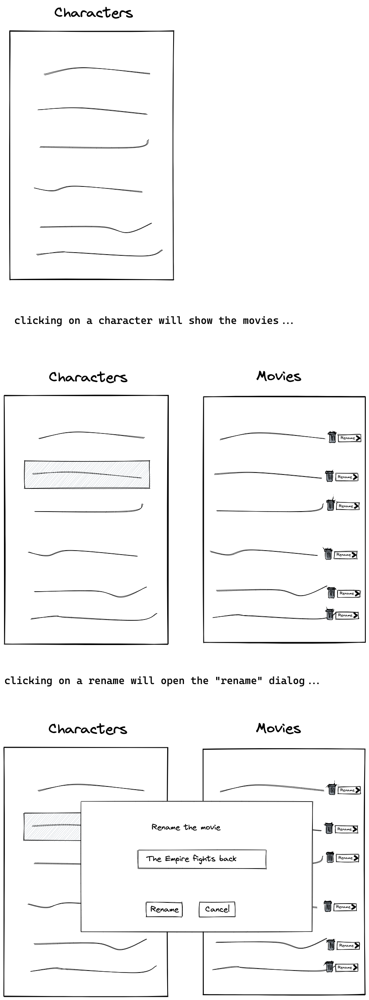

# Roundforest Web Frontend Home Assignment

You have been given this assignment as an alternative to the face to face technical qestions.

## How to do it

1. Read all the instructions in this page
1. Create a new Github repo
1. In the git repo, create a "blank" web app, using `create-react-app`, Angular CLI, or Vue CLI
1. Push to the github repo as a baseline
1. Start working on the assignment (see below for the assignment)
1. Push to the repo roughly once an hour. It doesn't have to be something complete or working or
   even something that builds. Just so I can see the progress.
1. Once you're done, do the last push. This, of course, should be working code.
1. Send the link to the Github repo, with instructions on how to run the app, to
   the person that gave you the assignment
1. Bask in the good feeling of having completed the assignment!

The assignment should take roughly 4-6 hours. Maybe less? Probably not more. ☺️

## Assignment

This is the Star Wars API: <https://swapi.dev/>. It's a simple REST API that returns information
about everything around Star Wars. You will create an app around this API.

- You will create a page that shows all the names of the characters in the movies
(i.e. those returned by <https://swapi.dev/api/people/>), in a list
(obviously, the list won't be hardcoded, but will be fetched dynamically from the Star Wars API).
- When the user clicks on a character, it will show a column on the right with the names
  of the movies that character is in.
- A delete button will delete the participation of the
  character in the movie.
- A "rename" button will show a dialog that enables
  renaming the movie (globally). The dialog should not be browser-native, but be a
  React/Angular/Vue-based dialog.
- Because the Star Wars API does not support eiting, the overrides (the deletions and renames)
  will be stored in the browser local storage.

The page should be designed nicely. While you may not be a designer (and that's OK!) it should look
passable and "nice".

## Rough sketch of the UI

You are at liberty to change this design as you see fit, if you would like. This is a rough sketch
just to make sure the above is understandable.

